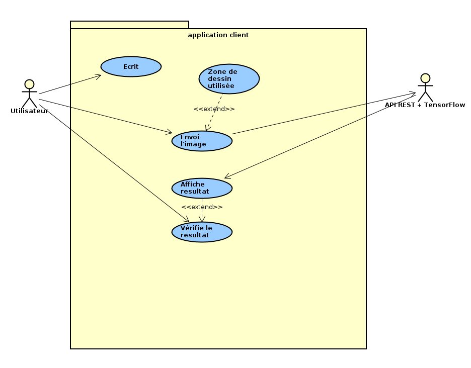
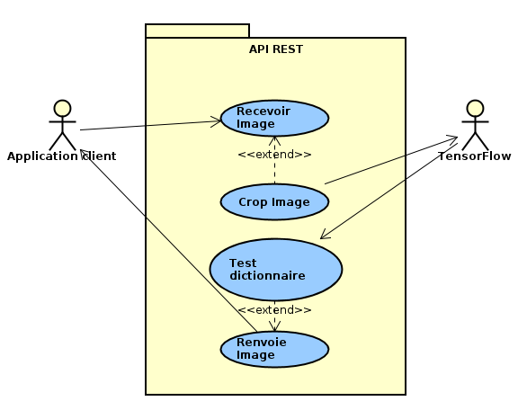
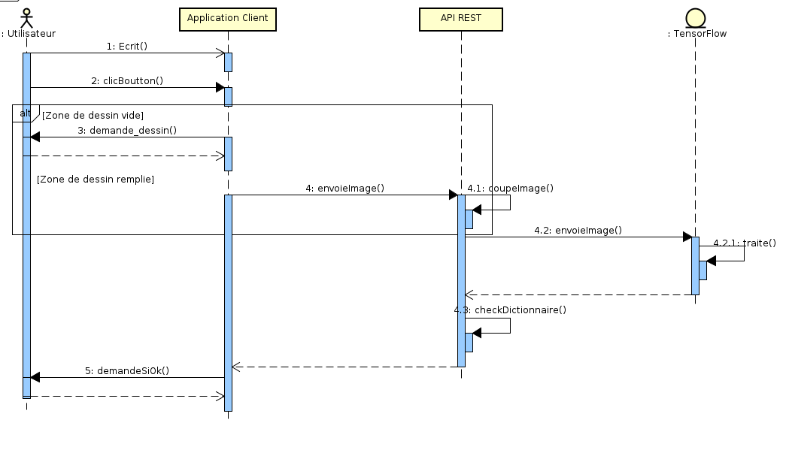

# Rapport de projet *Handwriting Recognition*

M1 :
--
  - Norman O'SHEA
  - Brice HARISMENDY
  - Valentin FARIA OLIVEIRA
  - Léonard PRADIER

M2 :
--
  - Alexis LEBLOND
  - Richard VACHERON

## Sommaire :
 - Contexte
 - Fonctionnement
 - Protocole
 - Apprentissage
 - Applications
 - Organisation
 - Conclusion

<!-- CONTEXTE -->
## Contexte :

### Sujet :
De nos jours, les écrans tactiles sont la base des tablettes et smartphones, mais sont aussi de plus en plus présents dans nos ordinateurs. Un nouveau segment a également fait son apparition : les tablettes/PC (comme la Surface de Microsoft).

Avec ces écran un nouvel usage consiste à écrire directement sur l’écran avec son doigt, un stylo passif ou un stylo actif. Pour que les mots écrits sous forme de dessin à l’écran soient convertis en texte utilisable dans un traitement de texte, une phase de reconnaissance est nécessaire. Il existe plusieurs applications et moteurs capables de réaliser cette tâche. Sur nos smartphones certains claviers virtuels reconnaissent les mots écrits, mais il existe également des applications de prise de notes qui permettent de convertir les mots écrits en texte comme Nebo/[MyScript](http://www.myscript.com/nebo/).

Le but de ce projet est de fournir un moteur de reconnaissance d’écriture manuelle portable et utilisable sur le maximum de plateformes possibles. Ce moteur pourra ensuite être utilisé comme base pour la réalisation d’applications tierces comme des logiciels de prise de notes manuscrites. Le projet est vaste, c’est pourquoi dans un premier temps, il faut se focaliser sur le moteur de reconnaissance.

Il existe déjà des projets en lien avec le sujet comme le moteur [HWRE](https://github.com/phatware/WritePad-Handwriting-Recognition-Engine), mais il est aussi possible de partir sur un nouveau projet, un moteur ouvert adapté au sujet. Pour reconnaître le texte manuscrit, il faut d’abord identifier les parties constituant le mot, les discrétiser. Plusieurs techniques et méthodes pourront être utilisées : reconnaissance de textes écrits et reçus sous forme d’images bitmap (couleur de l’encre) et/ou utilisation des gestes (point de départ du stylo, direction du mouvement, pression, ...) qui ont servi à écrire le mot. Il faut ensuite identifier le mot écrit, pour cela il est possible d’utiliser des techniques d’apprentissage. L’apprentissage des lettres, mots et phrases pourra se faire par utilisation d’un moteur de machine learning comme [TensorFlow](https://www.tensorflow.org/install/).

### But :
L'essentiel du projet est basé sur le deeplearning. Nous devons apprendre à TensorFlow à reconnaître des mots écrits à la main pour ensuite les communiquer au client. L'apprentissage étant une phase difficile nous approchons la reconnaissance de lettres et de chiffres. Nous coupons l'image en petites parties dans lesquelles nous allons chercher à reconnaître des lettres pour les mettre bouts à bout et retrouver le mot originel.

<!-- Fonctionnement -->
## Fonctionnement
Le projet est découpé en 3 grandes parties :

  - **L'application client:**  
Elle fait l'interface entre l'utilisateur et le serveur. Il permet à l'utilisateur d'écrire son mot avant de l'envoyer à l'intelligence artificielle pour recevoir la réponse.

  - **L'API REST:**  
Cette API permet de recevoir les données venant des applications client pour les traiter. Elle reçoit l'image émise par l'application avant de la couper afin qu'elle ait une forme carrée. Elle est ensuite envoyée à TensorFlow.

  - **TensorFlow :**  
Il permet de reconnaître la lettre, le mot, le chiffre envoyée par l'API sous forme d'image.  

**Diagramme de cas d'utilisation application client :**  

**Diagramme de cas d'utilisation API REST :**  

### Fonctionnement de base :
L'utilisateur écrit sur une tablette, un smartphone ou un ordinateur des mots. L'image est ensuite envoyée sur le serveur TensorFlow pour être traitée. L'image peut aussi être traitée en locale si l'intelligence artificielle est chargée directement sur l'appareil. Tensorflow traite l'image en l'envoyant dans un réseau de neurones qui permet selon .. de trouver le mot, la lettre ou le chiffre qui correspond. Le serveur renvoi ensuite le résultat pour l'afficher sur l'appareil de l'utilisateur.

### Réseau de neurones :
ETRE BREF ! (on peut copier WIKI mais citer les sources)
 un réseau de neurones est inspiré de la biologie humaine et des neurones du cerveau. Il est utilisé en statistique, en recherche, ...

### TensorFlow :
TensorFlow est un système d'apprentissage automatique développé en Python par Google sous licence Apache. Il supporte le calcul sur CPU et GPU et est disponible pour différentes plateformes et dispose d'API dans plusieurs langages de programmation (Python, C++, Java, Go, ...). C'est le moteur le plus puissant du marché.

<!-- PROTOCOLE -->
## Protocole :
### API REST :
L'API REST est écrite en Python. Elle utilise la bibliothèque [bottle](https://bottlepy.org/) pour les fonctionnalités réseau.
Elle reste toujours en écoute, les informations peuvent arriver à tout moment.
La réception d'une image se fait sur le port 8000 de notre serveur et à l'adresse */postimg*. Les informations arrivent sous forme de JSON afin de récupérer facilement les données. Une fois l'image récupérée, elle est coupée en carré puis envoyée à TensorFlow. Ce dernier lui envoie alors une réponse : un mot. Ce mot est passé dans le dictionnaire afin de savoir s'il a du sens et si il est correct (orthographiquement) avant de le renvoyer au client.
--> HTTP

<!-- APPRENTISSAGE -->
## Apprentissage :
La phase d'apprentissage est une des plus grosse partie de notre projet. Effectivement, la reconnaissance ne peut se faire sans une base de connaissance importante. Nous avons dû trouver un base imposante de données écrites à la main afin de permettre à TensorFlow d'avoir de quoi reconnaître différents types d'écritures.

<!-- APP CLIENTES -->
## Applications clientes :

Les applications clientes permettent le lien entre l'utilisateur et le serveur de reconnaissance. Elle affiche une zone de dessin qui permet à l'utilisateur d'écrire le mot. Elle envoie ensuite ce dessin sous forme d'image et attend la réponse du serveur.

### Android :
L'application Android est préconisée pour l'utilisation de notre programme. Il permet d'écrire plus facilement dans la zone de dessin avec un stylet.

### PC :

<!-- ORGANISATION -->
## Organisation

## Répartition des tâches :
Brice HARISMENDY | Norman O'SHEA | Valentin FARIA OLIVEIRA | Léonard PRADIER
- |:-: | :-: | -:  
Interface PC | Application Android | Application Android | Interface PC
Mise en place serveur TensorFlow | Analyse TensorFlow  | Apprentissage modèle | API REST
Interaction avec le serveur TensorFlow | | Modèle / Resolveur | Interaction API REST / interface TensorFlow
Apprentissage modèle| | |

## Outils
github

<!-- CONCLUSION -->
## Conclusion :
